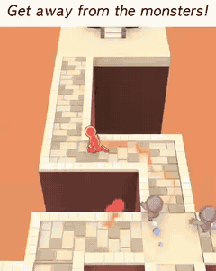
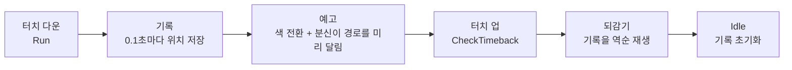
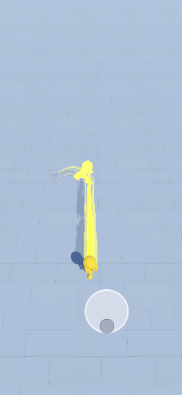
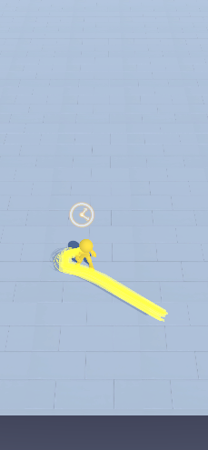
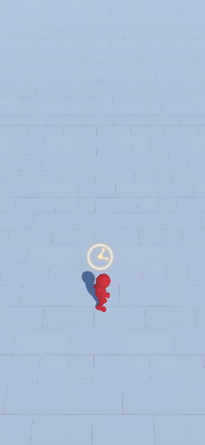

# TimeWalker 3D

지나온 길을 되감는 **타임백** 능력으로 퍼즐을 푸는 모바일 하이퍼캐주얼 게임

**자사 첫 누적 유저 100만** · MondayOFF 출시(2021.04) · [App Store](https://apps.apple.com/kr/app/time-walker-3d/id1560768338)



[게임플레이 영상 (mp4)](Media/gameplay.mp4)

| 항목 | 내용 |
|---|---|
| 기간 | 2021.01 ~ 2021.05 (4개월) |
| 팀 | 2인: Client Developer(본인) · Designer |
| 담당 | 기획 설계(메인), 클라이언트 기능 구현, 맵 레벨 디자인 150개, 출시 후 광고 테스트 기반 퍼널·리텐션 개선 |
| 플랫폼 | iOS · Android |
| 엔진 | Unity 2021.3 LTS (원본 프로젝트 기준) |
| 성과 | 자사 첫 누적 유저 100만 |

> **이 저장소의 범위**: **핵심 메커니즘(타임백) 프로토타입 C# 코드**를 포트폴리오용으로 옮겼습니다.
> 유료 에셋·아트·애니메이션·사운드·씬은 라이선스와 저작권 때문에 제외했으며, 그래서 이 저장소만으로는 실행되지 않습니다.

<br>

## 1. 핵심 메커니즘: 타임백

손가락을 누르면 달리고, 떼면 지나온 길을 거꾸로 되감습니다.



| 단계 | 동작 | 코드 |
|---|---|---|
| 기록 | 달리기 시작 0.75초 후부터 0.1초 간격으로 위치를 `List<Vector3>`에 저장 | [`Player.RecordPositionRoutine`](Scripts/Managers/Game/Player.cs#L41) |
| 예고 | 기록 시작 1초 후(터치 후 1.75초) 타임백 가능 상태로 전환: 머티리얼을 바꾸고 트레일을 켜고, 분신(AlterEgo)이 기록된 경로를 먼저 달려 **되감길 궤적을 미리 보여줌** | [`Player.AlterEgoRoutine`](Scripts/Managers/Game/Player.cs#L57) · [`AlterEgo.FixedUpdate`](Scripts/Managers/Game/AlterEgo.cs#L21) |
| 되감기 | 터치를 떼면 기록을 역순으로 재생해 위치 복귀, 시계 이펙트·사운드 동반 | [`Player.TimebackRoutine`](Scripts/Managers/Game/Player.cs#L84) · [`Clock`](Scripts/Managers/Game/Clock.cs) |

이 저장소 코드로 동작하는 모습입니다.

| 예고 | 되감기 | 복귀 |
|:---:|:---:|:---:|
|  |  |  |
| 타임백 가능 상태: 노란 몸 · 잔상 | 기록을 역순 재생 · 시계 이펙트 | 원위치 도착 · 기본 상태로 |

<br>

## 2. 설계 포인트

- **입력과 상태의 연결**
  - 조이스틱의 Down / Up 이벤트에 `Player`의 상태 전환(`SetAnimState(Run)` · `CheckTimeback`)을 연결하고, 이동은 조이스틱이 Rigidbody를 직접 움직입니다([`JoyStickController`](Scripts/Controller/JoyStickController.cs#L65))
  - `Player`는 `Idle · Run · Timeback · Death` 상태 전환과 기록 → 예고 → 되감기 코루틴을 함께 관리합니다([`SetAnimState`](Scripts/Managers/Game/Player.cs#L125))
- **코루틴 핸들 관리**: 상태가 바뀔 때 진행 중인 기록·예고·되감기 코루틴을 명시적으로 정리해 중복 실행을 막습니다
- **`WaitForSeconds` 캐싱**: 같은 대기 시간은 딕셔너리에서 재사용해 코루틴마다 생기는 GC 할당을 줄였습니다([`Util.GetWaitForSeconds`](Scripts/Utils/Util.cs#L12))
- **Managers 단일 진입점 + 풀링 연동**
  - `Managers.Resource.Instantiate`는 대상에 `Poolable`이 붙어 있으면 새로 만들지 않고 풀에서 꺼냅니다([`ResourceManager`](Scripts/Managers/Core/ResourceManager.cs#L67))

<br>

## 3. 구조

```
Scripts/
├─ Controller/
│  └─ JoyStickController.cs    고정·추종 두 방식의 가상 조이스틱, 입력 이벤트 발행
├─ Managers/
│  ├─ Core/                    공용 기반 (다른 프로젝트에도 재사용)
│  │  ├─ Managers.cs           단일 진입점 · 하위 매니저 보관
│  │  ├─ ResourceManager.cs    로드 · 생성 · 파괴 (풀링 연동)
│  │  ├─ PoolManager.cs        Stack 기반 오브젝트 풀
│  │  ├─ Poolable.cs
│  │  ├─ SoundManager.cs
│  │  └─ DataManager.cs
│  └─ Game/                    이 게임 전용
│     ├─ GameManager.cs        게임 상태 · 초기화 · 입력 연결
│     ├─ Player.cs             기록 → 예고 → 되감기
│     ├─ AlterEgo.cs           경로 미리보기 분신
│     ├─ Clock.cs              타임백 시계 이펙트
│     └─ CameraManager.cs
└─ Utils/
   ├─ Define.cs                게임 상태 · 애니메이션 · 사운드 enum
   ├─ Util.cs                  자식 탐색 · 대기 캐싱 · 좌표 변환
   └─ Extensions.cs            확장 메서드
```

<br>

## 4. 지금 다시 짠다면

동작 로직은 원본 그대로 두고, 지금 보이는 개선점 **4가지**를 함께 적습니다.

| # | 현재 | 문제 | 개선 방향 |
|:---:|---|---|---|
| 1 | 기록 소비를 `List.Remove(list[0])`로 처리 | 앞에서 지울 때마다 요소 전체가 한 칸씩 당겨짐(O(n)) | `List` + 시작 인덱스(앞 원소를 지우지 않고 인덱스만 증가) 또는 링 버퍼. 분신은 앞에서 소비하고 되감기는 뒤에서 읽어 `Queue`는 맞지 않음 |
| 2 | 위치만 0.1초마다 기록하고, 재생은 0.011초 대기로 한 점씩 | 대기가 한 프레임보다 짧아 사실상 프레임당 한 점씩 재생되어, 30fps 기기에서는 되감기가 2배 느려짐 | 기록 시각도 함께 저장하고, 되감기 시각을 `Time.deltaTime` × 배속(원본 60fps 기준 약 6~7배)으로 거꾸로 진행하며 두 기록 사이를 보간. 원래 움직임의 완급은 그대로, 되감기 시간은 기기와 무관 |
| 3 | `FindObjectOfType`로 참조 확보 | 씬 전체 탐색 비용, 초기화 순서에 의존 | 생성 시점에 명시적으로 등록 |
| 4 | 매직 넘버(분신 속도 35, 도착 판정 5, 대기 0.75초 등) | 레벨 디자인 중 수치 조정 때마다 코드 수정 | ScriptableObject 설정으로 분리 |

<br>

## 5. 출시와 운영

광고 테스트 지표로 개선 대상을 정하고, 빌드를 고쳐 다시 테스트하는 사이클을 반복했습니다.

| 단계 | 기준 지표 | 목적 |
|---|---|---|
| 1차 광고 테스트 | CPC · CPI | 광고 소재와 게임 컨셉의 시장 반응 검증 |
| 2차 광고 테스트 | CPI (1차 대비) | 스테이지 퍼널과 리텐션 개선 효과 확인 |
| 이후 | 2차와 같은 기준 | 퍼널·리텐션 개선 → 재테스트 반복 |

- 맵 레벨 150개를 직접 설계했습니다
- 대규모 프랍을 오브젝트 풀링으로 관리해 생성 · 파괴 비용을 줄였습니다
- 라이브 업데이트와 빌드 파이프라인을 관리했습니다
- 결과: **자사 첫 누적 유저 100만**
